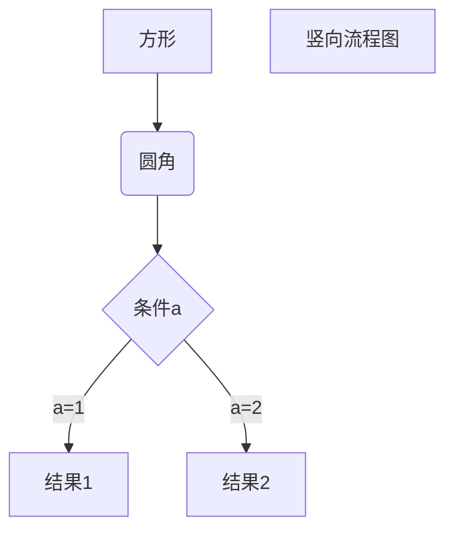

# 我的第一个 Markdown 文档

这是我学习 Markdown 的**开始**。

## 学习目标

这是一个链接 [菜鸟教程](https://www.runoob.com)
<https://www.runoob.com>

这是一个链接 [菜鸟教程](https://www.runoob.com)
欢迎访问 [GitHub](https://github.com) 官网
这是 [百度搜索](https://www.baidu.com "百度一下，你就知道")

markdown联系我：[发送邮件](mailto:example@email.com)
电话联系：[拨打电话](tel:+86-138-0013-8000)

| 月份 | 收入 | 支出 | 利润 | 增长率 |
|:----:|-----:|-----:|-----:|-------:|
| 1月 | ¥50,000 | ¥35,000 | ¥15,000 | - |
| 2月 | ¥55,000 | ¥38,000 | ¥17,000 | +13.3% |
| 3月 | ¥62,000 | ¥42,000 | ¥20,000 | +17.6% |
| **总计** | **¥167,000** | **¥115,000** | **¥52,000** | **+31.1%** |

